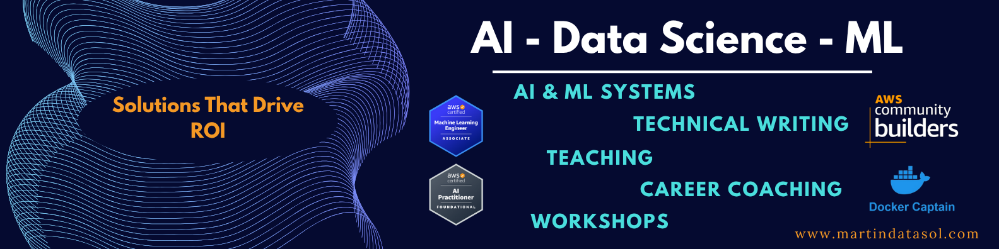

🚀 **Solutions That Drive ROI**

    
*🌟 Industry Recognition*

&nbsp;
**🏆 AWS ML/AI Certified** • **🚀 50+ Projects** • **📝 70+ Technical Articles** • **📚 1M+ Readers Reached** • **👨‍🏫 Teacher**

---

<h3 align="center">⬇️ You can find me here! ⬇️</h3>

**Personal Platforms**

**Professional Platforms**

---
## 📩 Projects Video Highlights

#### [Biomedical GraphRAG System](https://github.com/benitomartin/biomedical-graphrag)

#### [Production RAG System Course](https://github.com/benitomartin/substack-newsletters-search-course)

   

---
## 📩 My Substack Newsletter

---

## 🏛️ Trusted By Leading Companies

&nbsp;

### AWS Certifications

### Community Recognition

---

## 📬 Contact & Inquiries

*Technical content, consulting, coaching, and partnerships*

| For Technical Leaders | For Content Needs | For Partnerships | For Career Coaching |
|:---:|:---:|:---:|:---:|
|  |  |  |  |
| Development, Strategy | Tutorials, Documentation, Guides | Teaching, Collaboration, Consulting | Mentorship, Resume Help, Career Strategy |

---

## 👨‍💻 About Me

I specialize in teaching, technical writing, and developing practical, scalable systems that combine deep technical expertise with tangible business impact, ranging from LLM-powered applications to full-stack ML solutions.

Additionally, I am actively engaged with the global tech community as an [AWS Community Builder](https://builder.aws.com/community/@benitomartin), [Qdrant Star](https://qdrant.tech/stars/), and [Docker Captain](https://www.docker.com/captains/benito-martin/). Through these roles, I share my expertise, contribute to open collaboration, and help foster innovation across the cloud and developer ecosystems.

<table>
<tr>
<td width="33%" valign="top">

**Programming Languages**

**Machine Learning & Data Science**

**LLMs & AI**

**Vector Databases**

</td>
<td width="50%" valign="top">

**UI & REST APIs**

**MLOps & Engineering**

**DevOps Best Practices**

**Cloud & Infrastructure**

</td>
</tr>
</table>

---

## 📚 Featured Publications

My technical writing has been featured in major industry newsletters and platforms, such as LlamaIndex Newsletter, GKE Newsletter, and the MLOps community:

### Highlighted Articles
- 📝 [Smarter Food Classification with LiquidAI Vision Models](https://paulabartabajo.substack.com/p/smarter-food-classification-with)
- 📝 [The GitHub Issue AI Butler on Kubernetes](https://decodingml.substack.com/p/the-github-issue-ai-butler-on-kubernetes)
- 📝 [Your AI Football Assist Eval Guide](https://decodingml.substack.com/p/your-ai-football-assist-eval-guide)
- 📝 [Find Your Code! Scaling a LlamaIndex and Qdrant Application with Google Kubernetes Engine](https://www.linkedin.com/pulse/dymanic-workload-schedule-ga-confidential-computing-kms-sghiouar-ci8he/?trackingId=%2Bhgvw2lMQlSdKygvtG4MYA%3D%3D)
- 📝 [Building a Serverless Application with AWS Lambda and Qdrant for Semantic Search](https://home.mlops.community/public/blogs/building-a-serverless-application-with-aws-lambda-and-qdrant-for-semantic-search)
- 📝 [Multimodal LLM with Qdrant and Gemini](https://www.llamaindex.ai/blog/llamaindex-newsletter-2024-08-20)
- 📝 [RAG App with AWS CDK, Qdrant and LlamaIndex](https://www.llamaindex.ai/blog/llamaindex-newsletter-2024-09-24)
- 📝 [Building a Multimodal LLM Application with PyMuPDF4LLM](https://www.llamaindex.ai/blog/llamaindex-newsletter-2024-10-08)

### Publishing Platforms
[Medium](https://medium.com/@benitomartin) • [Zilliz](https://zilliz.com/authors/Benito_Martin) • [Artifex](https://artifex.com/blog/building-a-multimodal-llm-application-with-pymupdf4llm) • [DEV](https://dev.to/benitomartin) • [DataCamp](https://www.datacamp.com/blog/chunking-strategies) • [CircleCI](https://circleci.com/blog/author/benito-martin/) • [Decoding ML](https://decodingml.substack.com/p/your-ai-football-assist-eval-guide) • [AWS](https://builder.aws.com/community/@benitomartin)

---

## 🚀 Featured Projects

### 🧠 Advanced AI & LLM Applications

#### [Production RAG System Course](https://github.com/benitomartin/substack-newsletters-search-course)
- **Stack**: Qdrant, Supabase, Prefect, FastAPI, Docker, Google Cloud Run, Gradio/React
- **Features**: RAG-based retrieval, hybrid search, automated data ingestion

    

#### [Biomedical GraphRAG System](https://github.com/benitomartin/biomedical-graphrag)
- **Stack**: LangChain, OpenAI, Neo4j, Qdrant, FastAPI
- **Features**: Hybrid RAG combining Knowledge Graphs and Vector Databases

    

#### [LLM Evaluation and Observability System for Football Content](https://github.com/benitomartin/llm-observability-opik)
- **Stack**: OpenAI, Hugging Face, MongoDB, Comet ML, Opik, ZenML
- **Features**: LLM evaluation, observability, workflow automation

    

#### [Kubernetes-Powered GitHub Issues Multiagents Intelligence](https://github.com/benitomartin/github-issues-multiagent-intelligence)
- **Stack**: Docker, Qdrant, AWS EKS Fargate, AWS RDS, FastAPI, Guardrails AI
- **Features**: Hybrid search, auto-scaling, load balancer

    

#### [Collaborative Multi-Agent AI System with LangGraph](https://github.com/benitomartin/multiagent-langgraph-circleci)
- **Stack**: LangGraph, AWS Lambda, AWS Bedrock, Docker, CircleCI
- **Features**: Agent coordination, workflow automation, scalable deployment

    

#### [Multimodal Smart Document Processing System](https://github.com/benitomartin/aws-multimodal-bedrock-dynamodb)
- **Stack**: AWS Bedrock, Claude 3, AWS Lambda, AWS DynamoDB, AWS CDK
- **Features**: Text + image processing, event-driven architecture, serverless

    

### 🤖 End-to-end MLOps Systems

#### [Real-Time Crypto Forecasting Pipeline](https://github.com/benitomartin/mlops-llm-crypto-predictor)
- **Stack**: Quix Streams, MLflow, Kubernetes, Kafka, Grafana, PostgreSQL, Kind/Civo
- **Features**: Real-time inference, model registry, data validation, automated monitoring

    

#### [Financial Risk Assessment System](https://github.com/benitomartin/mlops-databricks-credit-default)
- **Stack**: Databricks, MLflow, LightGBM
- **Features**: Automated feature engineering, model monitoring, A/B testing

    

#### [Healthcare Cost Forecasting](https://github.com/benitomartin/mlops-aws-insurance)
- **Stack**: AWS SageMaker, TensorFlow, Comet ML, Flask
- **Features**: Automated retraining, cost optimization

    

### 🏗️ Data Engineering Solutions

#### [Swiss Air Quality Pipeline](https://github.com/benitomartin/de-ch-weather)
**End-to-end data engineering with modern tools**
- **Stack**: Mage, dbt, BigQuery, Terraform, Looker
- **Features**: Data quality checks, automated testing, visualization

    

---

### 🚀 **40+ Projects** across 5 categories

| Category | Description |
|----------|-------------|
| 🤖 **ML/MLOps** | Production-grade systems with comprehensive DevOps |
| 🧠 **AI & LLM** | Advanced AI applications and multi-modal systems |
| 📊 **Data Analysis** | End-to-end data science with advanced modeling |  
| 🔧 **Data Engineering** | Scalable pipeline solutions with modern tools |
| 🛠️ **Miscellaneous** | Utility applications and specialized tools |

### 👉 **[View Complete Project Portfolio →](PORTFOLIO.md)** 👈

&nbsp;

  
    
✨ *Thanks for visiting — Let’s connect and build something amazing together!* ✨  

