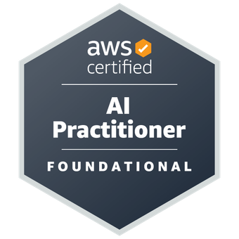

🚀 **Building the future, one algorithm at a time** 🚀

&nbsp;

<h3 align="center">⬇️ You can find me here! ⬇️</h3>

**Personal Platforms**

**Professional Platforms**

---

## 🎯 Quick Actions

&nbsp;

---

## 🏆 Certifications & Recognition

### AWS Certifications

### Community Recognition

---

## 🏛️ Trusted by Leading Companies

*Technical content, consulting, and educational partnerships*

---

## 👨‍💻 About Me

I specialize in teaching, technical writing, and developing practical, scalable systems that combine deep technical expertise with tangible business impact, ranging from LLM-powered applications to full-stack ML solutions.

### 🔧 Core Expertise

**Programming Languages**

**Machine Learning**

**LLMs & AI**

**Vector Databases**

**UI & REST APIs**

**Cloud & Infrastructure**

**MLOps & Engineering**

&nbsp;

**DevOps Best Practices**

&nbsp;

---

## 📚 Featured Publications

My technical writing has been featured in major industry newsletters and platforms, such as LlamaIndex Newsletter, GKE Newsletter, and the MLOps community:

### Highlighted Articles
- 📝 [Find Your Code! Scaling a LlamaIndex and Qdrant Application with Google Kubernetes Engine](https://www.linkedin.com/pulse/dymanic-workload-schedule-ga-confidential-computing-kms-sghiouar-ci8he/?trackingId=%2Bhgvw2lMQlSdKygvtG4MYA%3D%3D)
- 📝 [Building a Serverless Application with AWS Lambda and Qdrant for Semantic Search](https://home.mlops.community/public/blogs/building-a-serverless-application-with-aws-lambda-and-qdrant-for-semantic-search)
- 📝 [Multimodal LLM with Qdrant and Gemini](https://www.llamaindex.ai/blog/llamaindex-newsletter-2024-08-20)
- 📝 [RAG App with AWS CDK, Qdrant and LlamaIndex](https://www.llamaindex.ai/blog/llamaindex-newsletter-2024-09-24)
- 📝 [Building a Multimodal LLM Application with PyMuPDF4LLM](https://www.llamaindex.ai/blog/llamaindex-newsletter-2024-10-08)

### Publishing Platforms
[Medium](https://medium.com/@benitomartin) • [Zilliz](https://zilliz.com/authors/Benito_Martin) • [Artifex](https://artifex.com/blog/building-a-multimodal-llm-application-with-pymupdf4llm) • [DEV](https://dev.to/benitomartin) • [DataCamp](https://www.datacamp.com/tutorial/modulo-operator-python) • [CircleCI](https://circleci.com/blog/author/benito-martin/)

---

## 🚀 Featured Projects

### 🤖 Production MLOps Systems

#### [Real-Time Crypto Forecasting Pipeline](https://github.com/benitomartin/mlops-llm-crypto-predictor)
- **Stack**: Quix Streams, MLflow, Kubernetes, Kafka, Grafana, PostgreSQL
- **Infrastructure**: Civo
- **Features**: Real-time inference, model registry, data validation, automated monitoring

#### [Financial Risk Assessment System](https://github.com/benitomartin/mlops-databricks-credit-default)
- **Stack**: Databricks, MLflow, LightGBM, Pydantic
- **Infrastructure**: AWS/Databricks
- **Features**: Automated feature engineering, model monitoring, A/B testing

#### [Healthcare Cost Forecasting](https://github.com/benitomartin/mlops-aws-insurance)
- **Stack**: SageMaker, TensorFlow, Comet ML, Flask
- **Infrastructure**: AWS
- **Features**: Automated retraining, cost optimization

### 🧠 Advanced AI & LLM Applications

#### [LLM Evaluation and Observability System for Football Content](https://github.com/benitomartin/llm-observability-opik)
- **Stack**: LangGraph, Bedrock, Docker, CircleCI
- **Infrastructure**: AWS
- **Features**: LLM evaluation, observability, workflow automation, production monitoring

#### [Collaborative Multi-Agent AI System with LangGraph](https://github.com/benitomartin/multiagent-langgraph-circleci)
- **Stack**: LangGraph, Bedrock, Docker, CircleCI
- **Infrastructure**: AWS
- **Features**: Agent coordination, workflow automation, scalable deployment

#### [Kubernetes-Powered Semantic Code Search System](https://github.com/benitomartin/scale-gke-qdrant-llama)
- **Stack**: LlamaIndex, Qdrant, GKE, FastAPI, Streamlit
- **Infrastructure**: GCP
- **Features**: Semantic search, auto-scaling, production monitoring

#### [Multimodal Smart Document Processing System](https://github.com/benitomartin/aws-multimodal-bedrock-dynamodb)
- **Stack**: AWS Bedrock, Claude 3, DynamoDB, CDK
- **Infrastructure**: AWS
- **Features**: Text + image processing, event-driven architecture, serverless

### 🏗️ Data Engineering Solutions

#### [Hotel Reviews ETL Pipeline on GCP](https://github.com/benitomartin/de-hotel-reviews)
- **Stack**: Spark, Prefect, dbt, BigQuery, Terraform, Looker
- **Infrastructure**: GCP
- **Features**: Data quality checks, automated testing, visualization

#### [Swiss Air Quality Pipeline](https://github.com/benitomartin/de-ch-weather)
**End-to-end data engineering with modern tools**
- **Stack**: Mage, dbt, BigQuery, Terraform, Looker
- **Infrastructure**: GCP
- **Features**: Data quality checks, automated testing, visualization

---

### 🚀 **40+ Projects** across 5 categories

| Category | Description |
|----------|-------------|
| 🤖 **ML/MLOps** | Production-grade systems with comprehensive DevOps |
| 🧠 **LLM & RAG** | Advanced AI applications and multi-modal systems |
| 📊 **Data Analysis** | End-to-end data science with advanced modeling |  
| 🔧 **Data Engineering** | Scalable pipeline solutions with modern tools |
| 🛠️ **Miscellaneous** | Utility applications and specialized tools |

### 👉 **[View Complete Project Portfolio →](PORTFOLIO.md)** 👈

---

## 💼 Ready to Collaborate?

**Transform your ideas into production-grade ML & AI solutions**

&nbsp;

